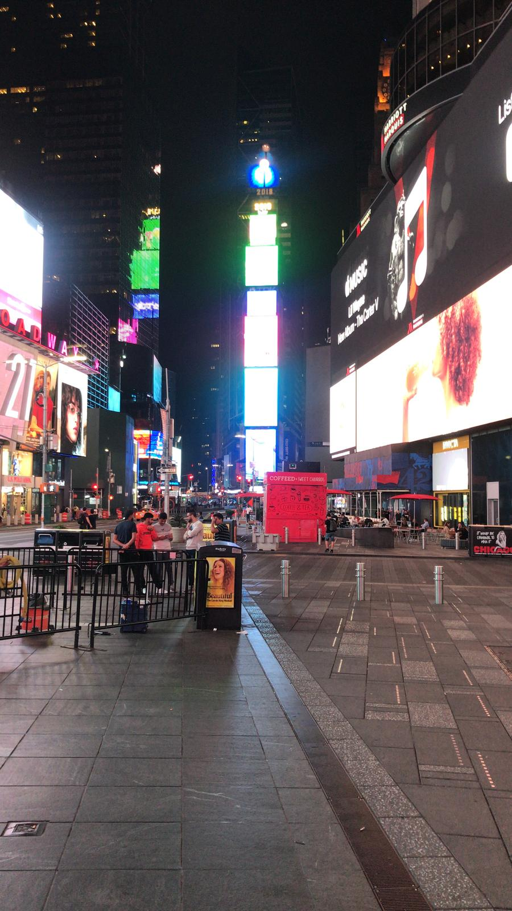

### I have a webpage!

And I can put all kinds of stuff on it!

Cab add text
*Can* add code but will not
Knit and update website

Relationship between yml and md, yml want the same appearance on all rmds in the website, structure, format name is he same as the headers of r markdown, the difference is the nav, the piece at the top is the same on all pages of the website

## add some links
I like [I Like to look for code to the internet](https://www.google.com/).

I can link directly to my [about page](about.html) without having to type the https....
 
 Now embed a picture
 
 